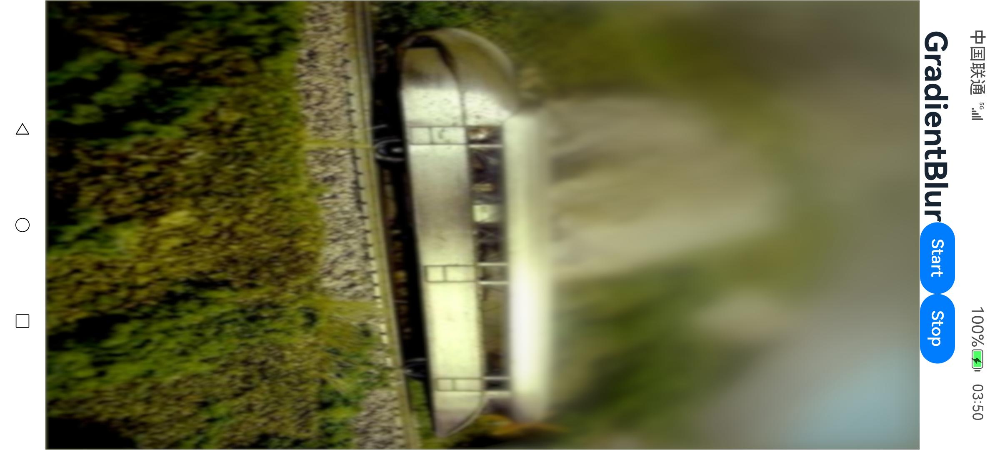

# 渐变模糊效果技术

# 📚目录

- [项目介绍](#赛题介绍)
- [项目难点](#项目难点)
- [优化方案1 X-DualGradientBlur](#方案一-x-dualgradientblur)
- [优化方案2 X-SAT](#方案二-x-sat)

# 项目介绍

渐变模糊是指图像的模糊程度沿着某个方向变化，从无到有，从强到弱。OpenHarmony开源操作系统为UI组件提供了渐变模糊接口，其调用了图形子系统的 `graphic_2d`中的渐变模糊算法。由于渐变模糊对GPU算力要求高，而移动端上的GPU性能通常较弱，我们需要设计高效算法，到达效果与性能的平衡。

**赛题要求性能较OpenHarmony已有算法优化50%以上，需要满足移动端设备的满帧运行**。

渐变模糊效果示例图：

# 项目难点

- 理论层面：模糊算法优化技巧、渐变实现方法、GPU并行计算优化、Arm Mali GPU架构
- 实现层面：
  - 方案1：`Skia`图形引擎的使用、`Skia Shader Language`编写。
  - 方案2：`OpenGL Compute Shader`编写、`Parallel Prefix Sum(Scan)`特定GPU优化。

# 项目亮点

我们分析了OpenHarmony现有的两种渐变模糊算法：

- OH4.0 可变模糊半径的均值模糊
- OH4.1 固定模糊半径的高斯模糊并使用LinearGradientMask与原图混合

提出了两种优化方案：

- 初赛方案

  - 沿用OH4.1思路，修改graphic_2d源码，实现两种更高效的渐变模糊算法：DualKawaseGradientBlur 和 DualGrainyGradientBlur
  - 解决OH4.1思路中存在的计算浪费问题
  - RK3568开发板 满帧运行
- 决赛方案：

  - 使用XComponent和OpenGL Compute Shader并行计算积分图、实现O(1)复杂度的模糊操作
  - Algorithm Cascading思路优化算法，使用Brent Theorem给出证明
  - 考虑特定GPU平台的优化(Arm Mali-G57)
  - 开发者手机二代 满帧运行

# 初赛方案 X-DualGradientBlur

## 1.1算法设计

oh4.1使用了skia内置的优化过的Gaussian Blur，并使用LinearGradientMask修改模糊图像的alpha通道，最后与原图blend，从而实现渐变效果。由于赛题的要求是性能提升50%，我们思路是使用其他cost更低的模糊算法，同时尽可能保持模糊质量。

我们结合oh4.1的mask思路，修改系统源码，实现DualGrainyGradientBlur和DualKawaseGradientBlur两种算法。并对渐变模糊中存在的计算浪费问题进行了优化。

## 1.2帧率测试

方案一需要修改系统源码，所以使用了开源的RK3568进行测试，RK3568的帧率上限为69。测试环境：

1. RK3568开发板
2. OH4.1 标准系统
3. 分辨率 728 x 1280 (全屏)
4. 渐变模糊参数设置:

- radius: 60.0
- fractionStops: [[0, 0], [0, 0.5], [0.75, 0.6~0.9], [1, 1]]
- direction: GradientDirection.Top

测试结果如下：

| 算法                           | 帧数(上限69) | 渲染耗时(ms) | SpeedUp(较4.0)  | SpeedUp(较4.1)  |
| ------------------------------ | ------------ | ------------ | --------------- | --------------- |
| MeanLinearGradientBlur (OH4.0) | 36.9         | 26.63684     | -               | -               |
| MaskLinearGradientBlur (OH4.1) | 53.7         | 18.25747     | 45.9%           | -               |
| DualKawaseGradientBlur (Ours)  | 68.4         | 14.22790     | **87.2%** | **28.3%** |
| DualGrainyGradientBlur (Ours)  | 69.0         | 13.98004     | **90.5%** | **30.6%** |

## 1.3图像质量测试

我们的算法提升了帧率，同时也兼顾到了模糊质量。

图像质量指标：

- PSNR（峰值信噪比，Peak Signal-to-Noise Ratio），用于衡量两张图像之间差异。
- SSIM（结构相似性，Structural Similarity）基于人眼会提取图像中结构化信息的假设，比传统方式更符合人眼视觉感知。

MaskLinearGradientBlur是基于高斯模糊，而高斯模糊是高质量模糊的代表。因此，我们将MaskLinearGradientBlur产生的图像作为reference，分别计算DualKawaseGradientBlur和DualGrainyGradientBlur的PSNR和SSIM指标(指标都是越高越好)。

Kawase和Grainy的SSIM指标分别为0.998和0.921，这说明模糊质量很接近MaskLinearGradientBlur的效果。

# 决赛方案 X-SAT

## 2.1渐变模糊Xcomponent组件 `nativeblur`

我们开发了一个XComponent组件 `nativeblur`，它使用OpenGL Compute Shader构造积分图实现渐变模糊效果。

该组件的使用方式与原生的 `LinearGradientBlur`接口类似。

## 2.2算法设计

我们使用XComponent提供的native window创建EGL/OpenGL环境。使用OpenGL ES Compute Shader并行计算积分图SAT，并基于SAT实现渐变模糊，模糊半径无关 O(1)复杂度。开发者手机满帧运行，较OH4.1性能提升135%。

此外我们还对SAT并行算法优化：

- 理论层面: Algorithm Cascading思想，并行与顺序结合，并用Brent Theorem证明其有效性。
- 实现层面: 针对移动端GPU Arm Mali-G57（Valhall架构）特定优化:Shared memory，Cacheability，Lower Precision...

### 积分图/2D前缀和

积分图 [Summed-area_table](https://en.wikipedia.org/wiki/Summed-area_table)，其实是二维前缀和 `2D Prefix Sum` 在图像领域的特指。假设原图像为 $T(x,y)$ ,则积分图 $S(x,y)$ 为：

$$
S(x,y)=\sum_{\begin{array}{c}x^{\prime}\leq x\\y^{\prime}\leq y\end{array}}T(x^{\prime},y^{\prime})
$$

- 计算原始图像的任意矩形区域内的和，只需要对积分图进行4次采样。基于上述性质，**任意半径**的均值模糊都可以在$O(1)$内完成。进一步使用Mask计算出每一个像素的模糊半径，就可以实现$O(1)$内的渐变模糊。
- 堆叠多个区域可以使得模糊质量更高。如下图所示，堆叠了三个区域，每个像素则需要12次采样。

 

为什么要使用积分图？主要总结为以下三点：

1. 对于任意模糊半径 `n`，每个像素都只需要4次采样，$O(1)$复杂度。而传统均值模糊/高斯模糊(使用线性分解)，时间复杂度为$O(n)$。
2. Prefix Sum可以在GPU上并行计算。2D Prefix Sum可以归结于1D Prefix Sum，类似于线性分解：对每一行做 `1D Prefix Sum`，再对每一列做 `1D Prefix Sum`。
3. 原始图像不变的情况下(符合当前的使用场景)，积分图只需要构造一次。如果渐变参数实时变化，我们可以使用相同的积分图进行实时渲染，而不需要实时更新积分图。

## 2.3帧率测试

测试环境：

1. 开发者手机二代，B613版本镜像包
2. OH4.1 标准系统
3. 渐变模糊参数设置:

- fractionStops: `[[0, 0], [0.2, 0.5~0.9], [1, 1]]`
- direction: `GradientDirection.Top`

### 不实时更新积分图

### 实时更新积分图

渲染分辨率1080x2184，纹理尺寸1024x1024, 模糊半径 120,  数据类型为float32，3 BoxBlur。

