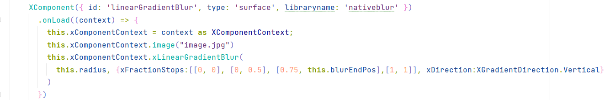
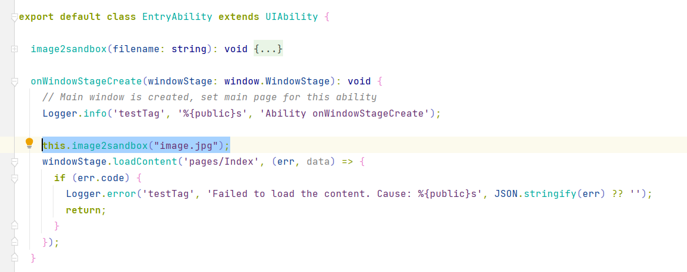

# GradientBlur

## 介绍

本项目使用官方的XComponent3D示例作为目标，开发基于积分图的渐变模糊效果。

基于XComponent组件调用Native API来创建EGL/GLES环境，从而使用标准OpenGL ES以及计算着色器Compute Shader实现图像渐变模糊效果。

## 工程目录

```
entry/src/main/ets/
|---entryability
	|---EntryAbility.ts
|---interface
    |---XComponentContext.ets   	// XComponent在ArkTs侧暴露的函数
|---pages
	|---Index.ets			// 测试Demo
entry/src/main/cpp/
|---include
	|---util
		|---log.h 		// 日志类
		|---napi_manager.h	// 负责管理注册进来的多个XComponent控件，单例模式
		|---native_common.h	// napi函数注册工具
		|---types.h		// 常量类
        |---sat_shaders.h			// shader代码
	|---app_napi.h			// 实现XComponent的生命周期函数，注册napi绘制接口
	|---opengl_draw.h		// 绘制类，创建egl和opengl环境，暴露渐变模糊接口
	|---rectangle.h			// 四边形类，具体实现图像渐变模糊
|---app_napi.app
|---module.cpp
|---napi_manager.cpp
|---opengl_draw.cpp
|---rectangle.cpp
|---sat_shaders.h			
|---CMakeLists.txt
```

## 使用方法


Xcomponent `nativeblur`对外暴露的接口:
- `image(“img_filename”)` 指定要模糊的图像。图像需放置在`entry/src/main/resources/rawfile`文件夹下，支持jpg和png。
`nativeblur`从应用的sandbox中加载图片，首先需要将图片从hap包解压到sandbox路径下：
  
  在`entry/src/main/ets/entryability/EntryAbility.ts`中通过`image2sandbox(filename)`将图像解压至sandbox
 
- `xLinearGradientBlur(...)` 设定模糊参数，接口完全仿照系统自带的渐变模糊接口。 

## 效果展示


## 抓取trace

在`方案二trace.zip`中放了我们实测的trace文件，以及 `htrace.bat` 脚本用于抓取trace。

将trace文件导入到Smart-Perf可以分析帧率。

## 约束与限制

本示例仅支持标准系统上运行，支持设备：开发者手机二代; DevEco Studio 4.1; FULL SDK 11
