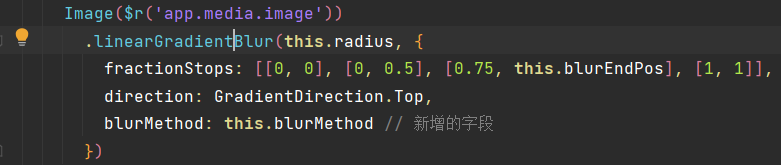
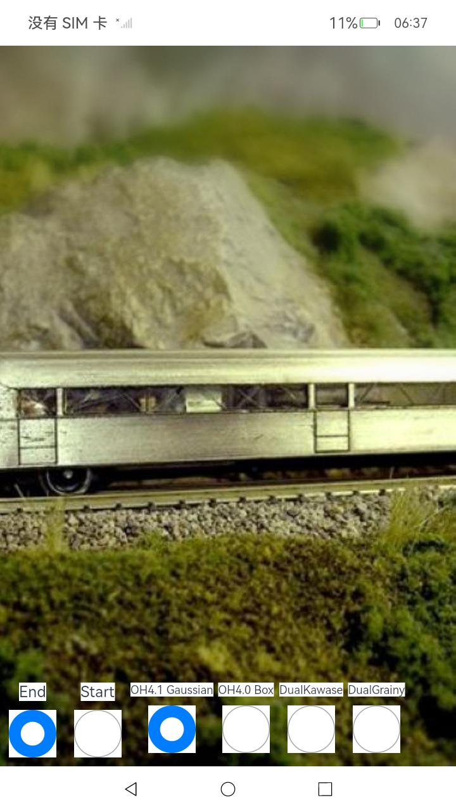
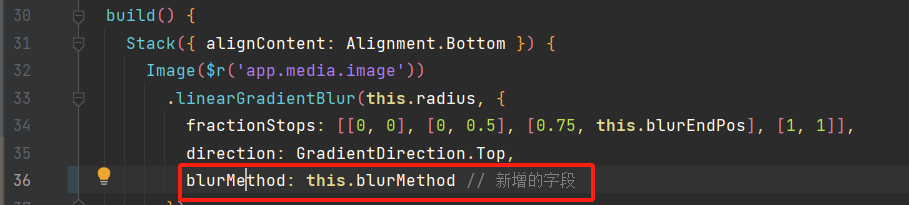
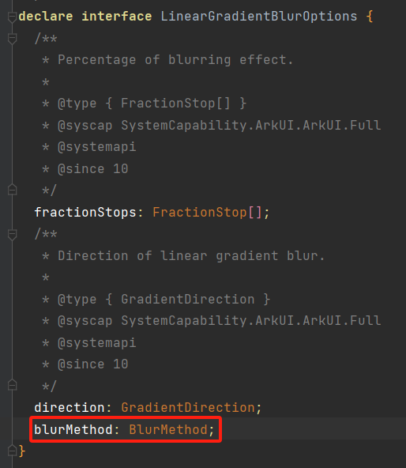
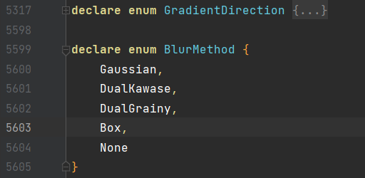
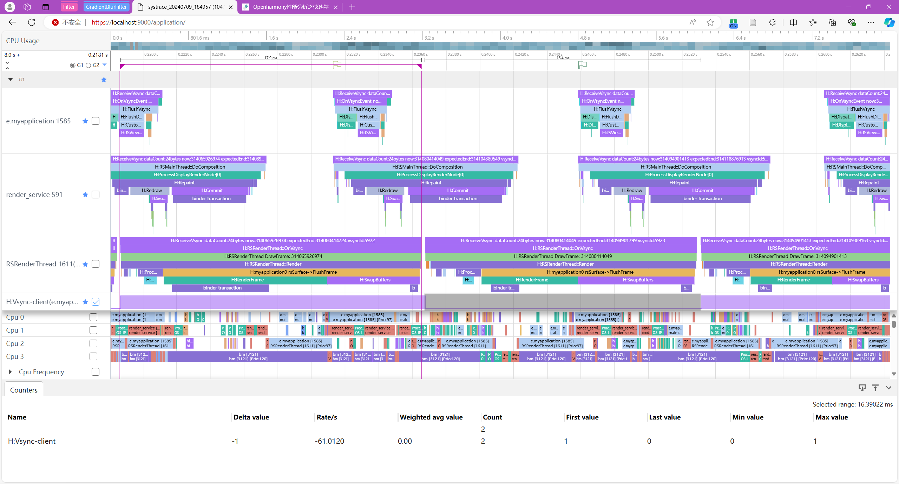

# Demo效果

> 源代码 `entry/src/main/ets/pages/Index.ets`

我们在前端页面中通过设置UI组件的属性 `.linearGradientBlur(radius, LinearGradientBlurOptions)`来产生渐变模糊的效果。例如下图所示：

- `radius`：模糊半径
- `direction` ： 模糊方向
- `fractionStops` ：[[first, second], ...], first:模糊程度, second:模糊位置。
  以上图为例：
  - [0, 0] - 以 `direction`为方向，起始位置(0)，模糊程度为0;
  - [0, 0.5] - 中间位置(0.5), 模糊程度也为0;
  - [0.75, this.blurEndPos] - `this.blurEndPos` 位置，模糊程度为0.75；
  - [1, 1] - 终点(1)位置，模糊程度为1；
- `blurMethod`：模糊方法
  - Gaussian，Box: OH4.1已有算法
  - DualKawase, DualGrainy: 我们的算法

    

为了能够实时渲染，当我们按下 `Start`按钮后，`this.blurEndPos`会上下变动，从而使得渐变模糊的效果在每一帧都会重新绘制。方便我们测试平均帧率。

# 在SDK的.d.ts中新增两个定义

我们在前端接口 `LinearGradientBlurPara`中新增一个字段 `BlurMethod`，而官方提供的SDK显然是没有 `BlurMethod`，因此会爆语法错误，提示 `LinearGradientBlurPara`中没有 `BlurMethod`字段。这只是IDE根据官网SDK中的类型声明文件而爆错，但我们开发板上运行的系统实际是有这个功能的。

为了让Demo能够通过语法检查，我们只需要在类型声明文件中添加这个字段的定义。

按住 `ctrl`点击上图中的 `direction`，就会进入 `common.d.ts`文件，这个文件是存放ts类型声明的。

在 `direction: GradientDirection`下面新增一行 `blurMethod: BlurMethod;`，保存。不出意外的话，`BlurMethod`会报错。只需要按住 `ctrl`点击图中的 `GradientDirection`，会进入 `enums.d.ts`的文件，新增如下图所示的enum，保存，就能正常编译Demo了。

# 抓取trace

`./trace.zip`里放了我们实测的trace，和 `systrace.bat` 脚本用于抓取trace。

官方SDK中带有hdc(Huawei device connector)，将hdc添加至环境变量后，在cmd中输入 `hdc shell`，即可以命令行的方式进入OpenHarmony系统。

> 一般在 `C:\Users\xxx\AppData\Local\OpenHarmony\Sdk\11\toolchains`文件夹下

在Demo中选择某一个模糊方法后，点击 `Start`按钮，渐变模糊效果将开始实时渲染。此时，在电脑端双击我们提供的 `systrace.bat`脚本文件，它将会使用hdc抓取trace，并将trace文件传送到电脑上，保存在当前路径的 `trace`文件夹下。之后使用OpenHarmony提供的[SmartPert-Host](https://www.smartperf.host/)平台导入trace文件，就可以分析帧率啦！

> 可以本地部署SmartPert-Host，参考官方仓库
